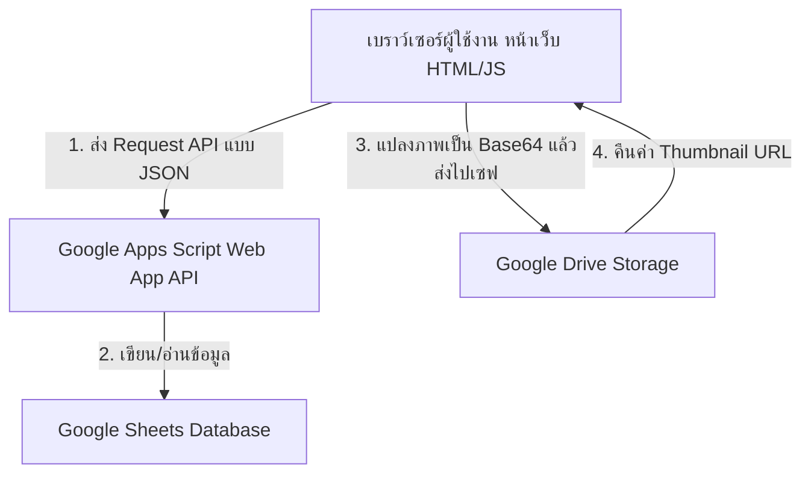

# 🌳 Silsilah (สิลสิลาห์) — ระบบแผนผังเครือญาติอัจฉริยะ

เว็บแอปพลิเคชันสำหรับบันทึกและแสดงผล **แผนผังเครือญาติ (Family Tree)** แบบโต้ตอบ (Interactive) เชื่อมต่อฐานข้อมูลฟรี 100% ด้วย **Google Sheets** และทำงานผ่าน **Google Apps Script**

[](https://opensource.org/licenses/MIT)


---

**"สิลสิลาห์" (Silsilah - سلسلة)** เป็นคำภาษาอาหรับที่มักใช้ในภาษามลายูและกลุ่มชาวไทยมุสลิม แปลว่า *ห่วงโซ่สายโลหิต* หรือ *ลำดับเครือญาติ* 

โปรเจกต์นี้ได้รับการพัฒนาขึ้นเพื่อให้ทุกครอบครัวสามารถมีเว็บไซต์ผังตระกูลของตัวเองได้ฟรี โดย **ไม่ต้องเช่าเซิร์ฟเวอร์ ไม่ต้องสมัครฐานข้อมูลราคาแพง** และมีดีไซน์ที่หรูหราทันสมัย (Modern Glassmorphism & Dark Mode) รองรับการแสดงผลทุกหน้าจอ

---

## 🌟 จุดเด่นของโปรเจกต์ (Features)

*   **ผังครอบครัวแบบไดนามิก (Dynamic Family Graph):** แสดงผลแผนผังเชื่อมโยงความสัมพันธ์ด้วยเส้นโค้ง SVG เรืองแสงที่สวยงาม (แยกสีตามประเภทความสัมพันธ์ พ่อ/แม่, ลูก, คู่สมรส, พี่น้อง, และบุตร/ผู้ปกครองบุญธรรม)
*   **ระบบควบคุมมุมมอง:** ลาก (Pan) เพื่อเคลื่อนย้าย และใช้ลูกกลิ้งเมาส์หรือการจีบนิ้วเพื่อย่อ-ขยาย (Zoom) แผนผังได้อย่างอิสระ พร้อมระบบปักหมุดเพื่อเริ่มต้นโฟกัสที่บุคคลใดบุคคลหนึ่ง
*   **ค้นหาอัจฉริยะ (Smart Search):** ค้นหาชื่อ นามสกุล หรือชื่อเล่นได้ทันทีแบบเรียลไทม์ โดยมีกลไกป้องกันการหน่วง (Debounce) ขณะพิมพ์
*   **ฐานข้อมูลบน Google Sheets:** ข้อมูลทั้งหมดจัดเก็บอย่างเป็นระเบียบใน Google Spreadsheet ของคุณเอง แก้ไขข้อมูลดิบได้ง่าย และปลอดภัย
*   **ฝากภาพโปรไฟล์บน Google Drive:** อัปโหลดภาพจากหน้าเว็บเข้าสู่โฟลเดอร์ Google Drive ของคุณโดยตรงโดยไม่เสียพื้นที่โฮสติ้งภายนอก
*   **ระบบรวมบุคคลซ้ำซ้อน (Merge Profiles):** ป้องกันปัญหากรณีต่างคนต่างกรอกข้อมูลเครือญาติแล้วมาเจอกันภายหลัง สามารถยุบรวมข้อมูลสองโปรไฟล์เข้าด้วยกัน พร้อมโอนย้ายความสัมพันธ์ทั้งหมดมาเชื่อมต่อให้อัตโนมัติ
*   **จัดการสิทธิ์ผู้ใช้หลายระดับ (Multi-User Roles):**
    *   **Visitor (ผู้เยี่ยมชม):** สามารถค้นหาและดูแผนผังได้เท่านั้น
    *   **Member (สมาชิกตระกูล):** สามารถเพิ่ม/แก้ไขข้อมูลบุคคล อัปโหลดรูป และเชื่อมความสัมพันธ์ได้
    *   **Admin (ผู้ดูแลระบบ):** สามารถอนุมัติหรือระงับสิทธิ์การใช้งานของสมาชิก ดูประวัติระบบ (Activity Logs) และเริ่มต้นระบบฐานข้อมูลได้

---

## 🛠️ โครงสร้างการทำงาน (Architecture)

ระบบถูกออกแบบมาในสไตล์ **Serverless & Static Site** เพื่อความง่ายในการดูแลรักษา:



---

## 🚀 ขั้นตอนการติดตั้งสำหรับมือใหม่ (Beginner Setup Guide)

> [!TIP]
> ไม่จำเป็นต้องมีความรู้เรื่องโปรแกรมมิ่งขั้นสูง เพียงทำตามขั้นตอนทีละขั้นด้านล่างนี้ คุณก็จะได้ระบบผังตระกูลออนไลน์เป็นของตัวเองทันที!

### ส่วนที่ 1: ตั้งค่าระบบหลังบ้าน (Google Sheets & Apps Script)

#### Step 1: เตรียมพื้นที่เก็บไฟล์ภาพบน Google Drive
1. ไปที่ [Google Drive](https://drive.google.com) ของคุณ
2. สร้างโฟลเดอร์ใหม่ ตั้งชื่อว่า `Silsilah Photos` (หรือชื่อใดก็ได้ตามต้องการ)
3. ดับเบิ้ลคลิกเข้าโฟลเดอร์นั้น จากนั้นสังเกตที่แถบที่อยู่ด้านบน (URL) จะพบรหัสยาวๆ ท้ายลิงก์ ให้คัดลอกรหัสนั้นเก็บไว้ (นี่คือ **Drive Folder ID**)
   *   *ตัวอย่าง:* หากลิงก์คือ `https://drive.google.com/drive/folders/1QP0-DjZYAbIKRmU7ShhR_L7claOGjZ_I` ค่า Folder ID คือ `1QP0-DjZYAbIKRmU7ShhR_L7claOGjZ_I`
4. คลิกขวาที่ชื่อโฟลเดอร์ เลือก **แชร์ (Share)** -> **แชร์ (Share)**
5. ในส่วนการเข้าถึงทั่วไป ให้เปลี่ยนจาก *จำกัด (Restricted)* เป็น **ทุกคนที่มีลิงก์ (Anyone with the link)** และกำหนดสิทธิ์เป็น **ผู้มีสิทธิ์อ่าน (Viewer)** จากนั้นกดเสร็จสิ้น *(ขั้นตอนนี้สำคัญมาก หากไม่ทำ รูปภาพโปรไฟล์จะไม่แสดงบนหน้าเว็บ)*

#### Step 2: สร้าง Spreadsheet และตั้งค่าสคริปต์
1. ไปที่ [Google Sheets](https://sheets.google.com) และสร้างสเปรดชีตว่างใหม่ 1 ไฟล์
2. ที่เมนูด้านบน คลิกที่ **ส่วนขยาย (Extensions)** > **Apps Script**
3. หน้าต่างโปรแกรม Apps Script จะเปิดขึ้นมา ให้ลบโค้ดในไฟล์เริ่มต้น (`รหัส.gs` หรือ `Code.gs`) ออกให้หมด
4. ในหน้าต่าง Apps Script ให้ทำการเพิ่มไฟล์สคริปต์ให้ครบถ้วน โดยกดปุ่ม **+ (เพิ่มไฟล์)** เลือกประเภท **สคริปต์ (Script)** แล้วตั้งชื่อให้ตรงกับไฟล์ `.gs` ในโฟลเดอร์โปรเจกต์นี้ จากนั้นคัดลอกโค้ดไปวางในแต่ละไฟล์:
   *   `Code.gs`
   *   `Auth.gs`
   *   `Person.gs`
   *   `Relation.gs`
   *   `Merge.gs`
   *   `Upload.gs`
   *   `Utils.gs`
5. เปิดไฟล์ `Utils.gs` ในบรรทัดที่ 5 มองหาตัวแปร `DRIVE_FOLDER_ID` ให้เอารหัสโฟลเดอร์ Google Drive จากข้อ 1 มาใส่แทนที่:
   ```javascript
   var DRIVE_FOLDER_ID = 'ใส่_FOLDER_ID_ตรงนี้';
   ```
6. กดปุ่ม **บันทึกโครงการ (Save Project - รูปแผ่นดิสก์)** ด้านบน

#### Step 3: เปิดใช้งานเป็น Web App (Deploy)
1. ที่มุมขวาบนของหน้า Apps Script คลิกที่ปุ่ม **การใช้งานได้ (Deploy)** > **การใช้งานใหม่ (New deployment)**
2. คลิกที่รูปฟันเฟืองข้าง "เลือกประเภท" เลือก **เว็บแอป (Web app)**
3. ตั้งค่าการดีพลอยดังนี้:
   *   **คำอธิบาย:** `Silsilah API`
   *   **เรียกใช้ในฐานะ (Execute as):** `ฉัน (อีเมลของคุณ)`
   *   **ผู้ที่สามารถเข้าถึง (Who has access):** `ทุกคน (Anyone)` *<- ขั้นตอนนี้สำคัญมาก หากไม่เลือกเป็น Everyone หน้าเว็บหน้าบ้านจะไม่สามารถส่งข้อมูลมาบันทึกได้*
4. คลิกปุ่ม **การใช้งานได้ (Deploy)**
5. ระบบอาจขอสิทธิ์การเข้าถึงข้อมูล ให้คลิก **ให้สิทธิ์เข้าถึง (Authorize access)** -> เลือกบัญชี Google ของคุณ -> คลิก **ขั้นสูง (Advanced)** -> คลิก **ไปที่ ... (ไม่ปลอดภัย)** -> กดยอมรับสิทธิ์ (Allow)
6. เมื่อดีพลอยสำเร็จ ระบบจะแสดง **URL ของเว็บแอป (Web app URL)** ให้คลิก **คัดลอก (Copy)** ลิงก์นี้เก็บไว้ (เช่น `https://script.google.com/macros/s/AKfy.../exec`)

#### Step 4: เริ่มต้นระบบฐานข้อมูล (Initialize Sheets)
1. นำ URL เว็บแอปที่คัดลอกมาจากข้อที่แล้ว เปิดในแท็บเบราว์เซอร์ใหม่
2. พิมพ์ตัวแปร `?init=true` ต่อท้าย URL นั้นแล้วกด Enter
   *   *ตัวอย่าง:* `https://script.google.com/macros/s/AKfy.../exec?init=true`
3. หากแสดงข้อความตอบกลับบนหน้าจอว่า `{"success":true,"message":"เริ่มต้นระบบสำเร็จ","data":null}` แสดงว่าฐานข้อมูลติดตั้งเสร็จสิ้นแล้ว!
4. ลองกลับไปดูหน้า Google Spreadsheet ที่คุณสร้างไว้ จะพบว่าระบบสร้างชีตให้โดยอัตโนมัติถึง 6 ชีต ได้แก่ `USERS`, `PERSONS`, `RELATIONS`, `MERGES`, `LOGS`, `SETTINGS`
5. บัญชีผู้ดูแลระบบตั้งต้นที่จะใช้เข้าเว็บคือ:
   *   **Username:** `admin`
   *   **Password:** `admin123` *(เพื่อความปลอดภัย กรุณาเข้าระบบเพื่อเปลี่ยนรหัสผ่านทันที)*

---

### ส่วนที่ 2: ตั้งค่าระบบหน้าบ้าน (Frontend Setup)

หลังจากตั้งค่าหลังบ้านเสร็จแล้ว คุณมีไฟล์ส่วนหน้าบ้าน (HTML/CSS/JS) ในมือถือหรือคอมพิวเตอร์ ให้ทำดังนี้:

1. เปิดไฟล์โปรเจกต์ ไปที่โฟลเดอร์ `assets/js` แล้วเปิดไฟล์ `config.js` ด้วยโปรแกรมแก้ไขข้อความ (เช่น Notepad, VS Code)
2. แก้ไขค่า `API_URL` โดยนำ URL เว็บแอปที่คุณได้จากการ Deploy ในขั้นตอนก่อนหน้า (ต้องเป็น URL แบบปกติ **ไม่มี** `?init=true` ต่อท้าย) มาใส่:
   ```javascript
   // config.js
   const CONFIG = {
     API_URL: 'https://script.google.com/macros/s/AKfy...ของคุณ.../exec',
     IMAGE_MAX_WIDTH: 800,
     IMAGE_QUALITY: 0.7,
     SEARCH_DEBOUNCE: 400,
     APP_NAME: 'สิลสิลาห์ — เครือญาติ'
   };
   ```
3. บันทึกและปิดไฟล์ `config.js`
4. ทดสอบเปิดใช้งานในเครื่องคอมพิวเตอร์ของคุณโดยการดับเบิ้ลคลิกไฟล์ `index.html` เพื่อเปิดใช้งานบนบราวเซอร์ได้เลย!

---

### ส่วนที่ 3: อัปโหลดขึ้นระบบออนไลน์ (GitHub Pages)

เพื่อให้คนอื่นๆ หรือญาติของคุณสามารถเข้ามาใช้งานเว็บไซต์ผ่านมือถือได้ทุกที่ แนะนำให้นำไฟล์หน้าบ้านไปฝากไว้บนโฮสติ้งฟรีอย่าง **GitHub Pages**:

1. สมัครใช้งาน [GitHub](https://github.com)
2. สร้าง Repository ใหม่ ตั้งชื่อว่า `silsilah` หรือตั้งเป็นแบบส่วนตัว/สาธารณะตามต้องการ
3. อัปโหลดไฟล์และโฟลเดอร์หน้าบ้านทั้งหมด (`index.html`, `login.html`, `admin.html` และโฟลเดอร์ `assets`) ขึ้นไปบน Repository นั้น
4. ไปที่เมนู **Settings** ของ Repository -> เลือกหัวข้อ **Pages** ทางซ้ายมือ
5. ในส่วน Build and deployment ให้เลือก Source เป็น `Deploy from a branch` และเลือก Branch เป็น `main` (หรือ `master`) จากนั้นกด Save
6. รอสักครู่ GitHub จะให้ URL เว็บไซต์ของคุณมา (เช่น `https://your-username.github.io/silsilah/`) ซึ่งลิงก์นี้สามารถส่งต่อให้เครือญาติเปิดเล่นได้ทันที!

---

## 📖 คู่มือการใช้งานโปรแกรม (User Guide)

### 1. การล็อกอินครั้งแรกและการเปลี่ยนรหัสผ่าน
*   กดปุ่ม **เข้าสู่ระบบ** ที่มุมขวาบนของหน้าเว็บ
*   กรอกชื่อผู้ใช้ `admin` รหัสผ่าน `admin123` เพื่อเข้าสู่ระบบในฐานะผู้ดูแลระบบสูงสุด
*   เพื่อป้องกันผู้ไม่หวังดี ให้ไปที่ระบบหลังบ้าน Google Sheets เปิดชีต `USERS` เพื่อดูบัญชี หากต้องการสร้างบัญชีใหม่หรือแก้ไข ให้แอดมินใช้แบบฟอร์มสมัครสมาชิกจากหน้าเว็บ หรือจัดการผ่านแดชบอร์ด

### 2. การสร้างบุคคลคนแรก (Root Node)
*   เมื่อลงชื่อเข้าใช้งานเรียบร้อยแล้ว หน้าแรกจะแสดงปุ่ม **+ เพิ่มบุคคลแรก**
*   คลิกที่ปุ่มเพื่อเปิดแบบฟอร์มการกรอกข้อมูล:
    *   ใส่ชื่อ, นามสกุล, ชื่อเล่น, เพศ
    *   ระบุวันเกิด/วันเสียชีวิต (หากล่วงลับแล้วให้ใส่วันเสียชีวิต การ์ดจะเปลี่ยนเป็นสีเทาทึบจาง)
    *   กรอกที่อยู่ เบอร์โทรศัพท์ พิกัดละติจูด/ลองจิจูด (ถ้ามี)
    *   เลือกอัปโหลดรูปถ่ายโปรไฟล์ (ระบบจะบีบอัดภาพและอัปโหลดไปที่ Google Drive อัตโนมัติ)
*   กด **บันทึก** ข้อมูลจะถูกเขียนลงไปในแผ่นสเปรดชีตทันที

### 3. การแสดงแผนผังและการขยายสายตระกูล
*   พิมพ์ค้นหาชื่อญาติในช่องค้นหาด้านบนของเว็บไซต์ ระบบจะแสดงการ์ดประวัติย่อ ให้คลิกที่การ์ดเพื่อเปิดหน้าผังตระกูล (Graph View)
*   บนหน้าผังตระกูล หากนำเมาส์ไปชี้ (Hover) ที่การ์ดบุคคล (หรือแตะ 1 ครั้งบนมือถือ) จะมีวงล้อควบคุมปรากฏขึ้น:
    *   `↑ (ปุ่มบน):` ขยายมุมมองเพื่อแสดง **พ่อและแม่** ของบุคคลนี้
    *   `↓ (ปุ่มล่าง):` ขยายมุมมองเพื่อแสดง **ลูกทุกคน** ของบุคคลนี้
    *   `💑 (ปุ่มซ้าย):` ขยายมุมมองเพื่อแสดง **คู่สมรส**
    *   `👨‍👩‍👧‍👦 (ปุ่มขวา):` ขยายมุมมองเพื่อแสดง **พี่และน้องร่วมบิดามารดา**
    *   `📌 (ปุ่มปักหมุดมุมขวาบนของการ์ด):` ย้ายโฟกัสให้บุคคลนี้เป็นจุดศูนย์กลางของแผนผังใหม่
*   หากต้องการเพิ่มคนใหม่ที่สัมพันธ์กับคนนี้ ให้กดปุ่ม **+ (ปุ่มกลางของวงล้อควบคุม)**

### 4. การจัดการความสัมพันธ์ (เพิ่ม/ลบ)
*   **การเพิ่มความสัมพันธ์:** หลังจากกดปุ่ม `+` บนวงล้อการควบคุมแล้ว จะมีป๊อปอัปให้เลือกประเภทความสัมพันธ์ และให้พิมพ์ค้นหาบุคคลที่มีอยู่ในระบบเพื่อนำมาเชื่อมโยงกัน หากบุคคลนั้นยังไม่มีข้อมูลในฐานข้อมูล ให้คลิกปุ่ม `+ เพิ่มบุคคลใหม่` เพื่อเพิ่มข้อมูลคนใหม่เข้าตระกูลก่อน
*   **การลบความสัมพันธ์ที่ผิดพลาด:** คลิกที่รูปภาพโปรไฟล์ของบุคคลเพื่อเปิดป๊อปอัปรายละเอียดประวัติ -> คลิกปุ่ม `✏️ จัดการความสัมพันธ์` ด้านล่างสุด -> กดปุ่ม **ถังขยะสีแดง** ข้างชื่อความสัมพันธ์ที่ต้องการลบเพื่อยกเลิกการเชื่อมโยง

### 5. การรวมข้อมูลบุคคลที่ซ้ำซ้อน (Merge)
*   หากพบว่ามีประวัติบุคคลเดียวกันถูกสร้างขึ้นซ้ำซ้อนในแผนผัง (เช่น สายญาติฝั่งคุณลุงและคุณป้ากรอกคนเดียวกันเข้ามาแยกกัน)
*   ให้ไปที่หน้าผังเครือญาติของคนใดคนหนึ่งที่ต้องการยุบรวม -> คลิกปุ่ม `🔗 Merge` ที่แถบเครื่องมือด้านบน
*   พิมพ์ค้นหาชื่อของโปรไฟล์อีกอันที่เป็นคนเดียวกัน
*   ตรวจสอบความถูกต้อง จากนั้นกดยืนยัน `⚠️ ยืนยัน Merge`
*   ระบบจะทำการคัดลอกความสัมพันธ์ทั้งหมดของโปรไฟล์เดิมไปผูกรวมไว้ที่โปรไฟล์ใหม่ โอนย้ายภาพถ่าย และลบโปรไฟล์เก่าที่ซ้ำซ้อนออกจากฐานข้อมูลโดยอัตโนมัติ

---

## 🔒 การบำรุงรักษาและการป้องกันข้อมูลสูญหาย (Backup & Maintenance)

เนื่องจากระบบใช้ Google Sheets เป็นฐานข้อมูล แอดมินจึงสามารถดูแลระบบได้อย่างง่ายดายดังนี้:
1.  **การสำรองข้อมูล (Backup):** ไปที่หน้า Google Spreadsheet แล้วกดเมนู **ไฟล์ (File)** > **ทำสำเนา (Make a copy)** เป็นประจำเพื่อเก็บสำรองข้อมูลตระกูลไว้กันพลาด
2.  **การแก้ไขข้อผิดพลาดรุนแรง:** หากเผลอลบข้อมูลความสัมพันธ์หรือบุคคลผิดพลาดจนกราฟไม่แสดงผล แอดมินสามารถเปิดสเปรดชีตเพื่อแก้ไข ลบ หรือกรอกข้อมูลด้วยตนเองลงในชีต `PERSONS` และ `RELATIONS` ได้โดยตรง
3.  **การควบคุมความปลอดภัย:** แอดมินสามารถสลับแท็บไปที่ `Activity Log` บน Dashboard ในหน้า `admin.html` เพื่อดูว่าสมาชิกท่านใดเข้ามาทำรายการอะไรไปบ้าง เพื่อความโปร่งใสและตรวจสอบได้ง่าย

---

## 📄 สัญญาอนุญาต (License)

ซอร์สโค้ดนี้เผยแพร่ภายใต้สัญญาอนุญาต **MIT License** สามารถนำไปดัดแปลง ใช้งานส่วนตัว หรือพัฒนาต่อยอดเพื่อชุมชนได้ฟรีโดยไม่มีค่าใช้จ่าย

---

*ร่วมสร้างและบันทึกรากเหง้าของตระกูล เพื่อส่งต่อเรื่องราวสายโลหิตไปยังรุ่นสู่รุ่น ด้วยระบบสิลสิลาห์* 🌳
